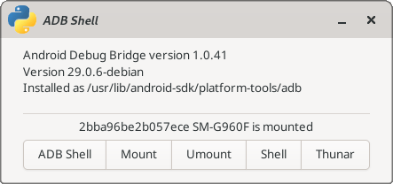

# ADB Shell
Simple shell for [adb](https://developer.android.com/studio/command-line/adb) and [android-fuse](https://github.com/bailuk/android-fuse): list, mount and access connected Android devices

## Dependencies
- python3
- [python gtk3 bindings](https://pygobject.readthedocs.io/en/latest/)
- [adb](https://developer.android.com/studio/
- [android-fuse](https://github.com/bailuk/android-fuse) or other filesystem support for Android devices

## Configuration
Adjust `dict` entries inside constructor of `Config` class (at beginning of scrip).

## Run
`python3 ./adb-shell.py`

## Screenshot

